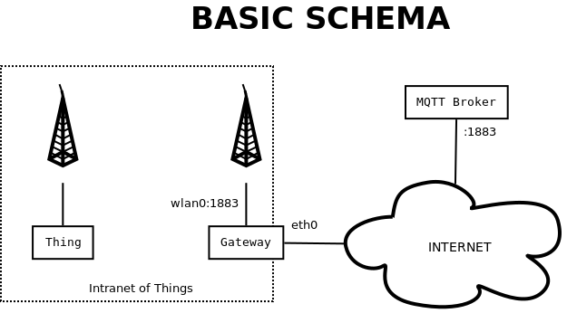

# Custom IoT gateway

## Introduction
The purpose of this proof of concept is to test the viability of building our custom IoT gateway to solve the detected needs in the Edge/Bus.

This is the basic architecture we are going to test.



## How to
There are three independent parts to set up:
* [Set up the gateway](gateway/README.md)
* [Set up the data platform](data_platform/README.md)
* [Set up the thing](thing/README.md)


## Running the PoC
Requirements:
1_ The gateway is working.
1_ The MQTT broker is running.
1_ The thing is flashed with the firmware.


### Bridge the MQTT to the intranet
So far the gateway is configured in a generic way. For our intentions, it is needed to make the MQTT broker to be visible inside the intranet so things can connect to it.
We don't want things to connect directly to the internet, instead we want to simulate the gateway provides the MQTT service. That is a reverse NAT service.


Add the following line to `/etc/shorewall/rules`.
```
DNAT            wifi            wired:INV01361.local  tcp       1883
```

Create a masquerade file `/etc/shorewall/masq` with the following content.
_NOTE: I think this is not correct, but is the only way it worked. I also tested snat as masq is deprecated._
```
wlan0 eth0
eth0 wlan0
```

And restart the service.

```
service shorewall restart
```

### Listening in the data platform

http://www.hivemq.com/blog/mqtt-essentials-part-5-mqtt-topics-best-practices
