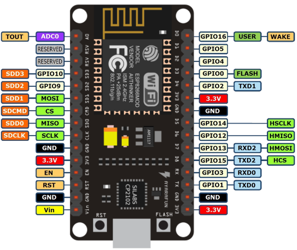

# Thing Set up

## Table of contents
* [Hardware](#hardware)
* [Software](#software)

## Hardware 
* Board: [NodeMcu board](http://www.nodemcu.com/index_en.html)
* Temperature/Humidity sensor: DHT11
 * Pin: D1-GPIO5
* Actuator: LED diode
 * Pin: D2-GPIO4

## Software 
* File: `firmware.lua`
* Description: firmware in Lua for NodeMcu.
 1. Connect to the WiFi network.
 1. Create a MQTT client.
 1. Publish temperature and humidity every n seconds.
 1. Subscribe to a topic and operate the led in consonance.

## How To
You just need to copy the file `firmware.lua` to the device.
For further instructions, see the repository [smh_nodemcu](https://github.com/samuelmh/smh_nodemcu).
